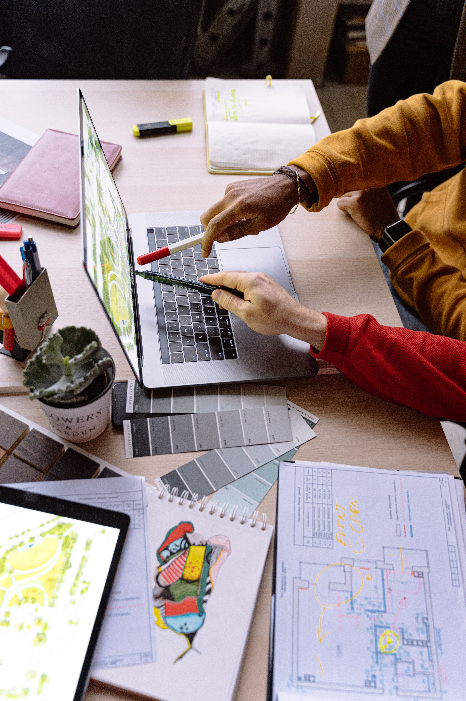

# Professional Goals

Five years after graduation, I hope to be working in UX/UI or product design, with experience working on real digital designs. By that time i would hope to have a great portfolio of projects showcasing my research, design process, prototypes, and final solutions.

I also want to gain experience dealing with clients and various teams. By that point, i hope to also be able to confidently explain my design decisions, solve real-world user problems, and continue to enhance my web design, digital product development and sales skills.